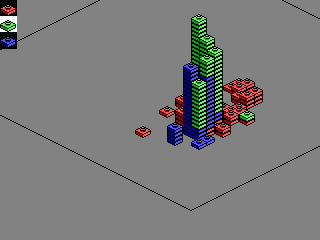

# Aleggo

This is a simple desktop toy for building with simple blocks. It's built with Allegro 4 with the intention of being compatible with MS-DOS.

Right now it's a very rough proof of concept. Ideally, a complete version would have more blocks, have drag and drop support, and generally be more polished.

